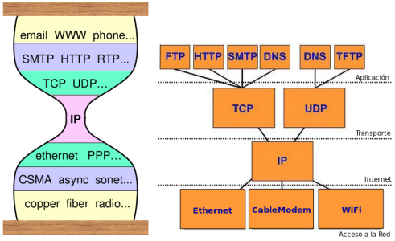
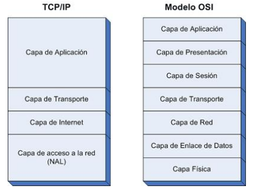

# Práctica 1 - Introducción

## 1. ¿Qué es una red? ¿Cuál es el principal objetivo para construir una red?
Una red, en el ámbito informático, es un conjunto de dispositivos interconectados que pueden comunicarse entre sí para compartir recursos, información y servicios. El principal objetivo de construir una red es permitir la comunicación eficiente y el intercambio de datos entre diferentes dispositivos, facilitando la colaboración, el acceso a información y la utilización compartida de recursos como impresoras, almacenamiento y aplicaciones. Ejemplos: Internet, una red local (LAN) en una oficina, o una red de área amplia (WAN) que conecta sucursales de una empresa, etc.                   

## 2. ¿Qué es Internet? Describa los principales componentes que permiten su funcionamiento.
Internet es una **red de redes** de computadoras descentralizada, pública y global que conecta millones de redes privadas, académicas, empresariales y gubernamentales, permitiendo la comunicación y el intercambio de información a nivel mundial. Los principales componentes que permiten su funcionamiento incluyen:
- **Protocolo de Internet (IP)**: Es el conjunto de reglas que rigen la forma en que los datos se envían y reciben a través de la red.
- **Servidores y clientes**: Los servidores proporcionan servicios y recursos, mientras que los clientes acceden a ellos.
- **Routers y switches**: Dispositivos que dirigen el tráfico de datos entre diferentes redes y dispositivos.
- **Proveedores de servicios de Internet (ISP)**: Empresas que proporcionan acceso a Internet a los usuarios finales.
- **Cables y enlaces de comunicación**: Infraestructura física que permite la transmisión de datos, incluyendo fibra óptica, cables de cobre y enlaces inalámbricos.
- **Protocolos de comunicación**: Conjuntos de reglas y estándares que permiten la interoperabilidad entre diferentes sistemas y aplicaciones, como TCP/IP, HTTP, FTP, etc.

Sigue un modelo hourglass o reloj de arena:

## 3. ¿Qué son las RFCs?
Las RFC (Request for Comments) son documentos técnicos que describen estándares, protocolos, procedimientos y mejores prácticas para la operación de Internet. Son publicados por el Internet Engineering Task Force (IETF) y son fundamentales para el desarrollo y evolución de los protocolos de red. 
### Categorías 
#### Standard Track
- **Proposed Standard**: Se les asigna RFCnnnn y no requieren implementación
- **Internet Standard**: Existen implementaciones y significante experiencia operacional. Se retiene el RCFnnnn y se agrega STDxxxx

#### Off-Track
- **Informal/Experimental**: Otro proceso, se publica como Internet Draft (ID), pero se coloca en otra categoría. No se espera que se implemente, pero puede ser útil para la comunidad.
- **Best Current Practice (BCP)**: Se publica como RFCnnnn y se espera que sea implementado. No es un estándar, pero es una práctica recomendada.
- **Historic (STD Obsoletas)**: las RFCs se van actualizando o se pueden declarar obsoletas por otras.
- **FYI (For Your Information)**: Como INFORMATIONAL.

### Ejemplos en
http://www.rfc-editor.org/rfcxx00.html.

## 4. ¿Qué es un protocolo?
Un protocolo es un conjunto de reglas y estándares que definen cómo se comunican y colaboran los dispositivos en una red. Estas reglas especifican el formato, el orden y la sincronización de los mensajes intercambiados entre los sistemas.

## 5. ¿Por qué dos máquinas con distintos sistemas operativos pueden formar parte de una misma red?
Dos máquinas con distintos sistemas operativos pueden formar parte de una misma red porque los protocolos de red están diseñados para ser independientes del sistema operativo. Esto permite que diferentes tipos de dispositivos se comuniquen entre sí a través de la red, siempre que sigan las mismas reglas y estándares.

## 6. ¿Cuáles son las 2 categorías en las que pueden clasificarse a los sistemas finales o End Systems? Dé un ejemplo del rol de cada uno en alguna aplicación distribuida que corra sobre Internet.
Las 2 categorías en las que pueden clasificarse a los sistemas finales o End Systems son:
1. **Clientes**: Son dispositivos que solicitan servicios o recursos de otros sistemas en la red. Ejemplo: Un navegador web (cliente) que solicita una página web a un servidor web.
2. **Servidores**: Son dispositivos que proporcionan servicios o recursos a otros sistemas en la red. Ejemplo: Un servidor de correo electrónico que recibe y envía correos electrónicos a los clientes de correo electrónico.

## 7. ¿Cuál es la diferencia entre una red conmutada de paquetes de una red conmutada de circuitos?
La diferencia entre una red conmutada de paquetes y una red conmutada de circuitos radica en cómo se establece la comunicación entre los dispositivos:
- **Red conmutada de circuitos**: Establece un camino dedicado y exclusivo entre los dispositivos durante toda la duración de la comunicación. Este tipo de red es más eficiente para transmisiones continuas y de larga duración, como llamadas telefónicas. Sin embargo, puede ser menos eficiente en términos de utilización del ancho de banda, ya que el canal permanece ocupado incluso si no se están transmitiendo datos.

- **Red conmutada de paquetes**: Divide los datos en paquetes y los envía de manera independiente a través de la red. Cada paquete puede tomar rutas diferentes y se reensamblan en el destino. Este enfoque es más eficiente en términos de utilización del ancho de banda y permite la transmisión de datos de manera más flexible y escalable. Es el enfoque utilizado en Internet y otras redes modernas.

## 8. Analice qué tipo de red es una red de telefonía y qué tipo de red es Internet.
Una red de telefonía es una red conmutada de circuitos, ya que establece un camino dedicado y exclusivo entre los dispositivos durante toda la duración de la comunicación. En cambio, Internet es una red conmutada de paquetes, ya que divide los datos en paquetes y los envía de manera independiente a través de la red.

## 9. Describa brevemente las distintas alternativas que conoce para acceder a Internet en su hogar.
Las distintas alternativas para acceder a Internet en mi hogar son:
1. **Conexión de banda ancha por cable**: Utiliza la infraestructura de televisión por cable para proporcionar acceso a Internet de alta velocidad.
2. **Conexión de fibra óptica**: Utiliza cables de fibra óptica para ofrecer velocidades de Internet muy altas y una conexión más estable.
3. **Conexión ADSL (Línea de Abonado Digital Asimétrica)**: Utiliza la línea telefónica para proporcionar acceso a Internet, aunque generalmente ofrece velocidades más bajas que las opciones de banda ancha por cable o fibra óptica.
4. **Conexión inalámbrica (Wi-Fi)**: Permite el acceso a Internet a través de una red inalámbrica, utilizando un router que se conecta a un proveedor de servicios de Internet.
5. **Conexión móvil (3G/4G/5G)**: Utiliza la red de telefonía móvil para proporcionar acceso a Internet a través de dispositivos móviles como teléfonos inteligentes y tabletas, aunque puede estar limitada por la cobertura y la velocidad de la red móvil.

## 10. ¿Qué ventajas tiene una implementación basada en capas o niveles?
Las ventajas que tiene una implementación basada en capas o niveles son:
- Reduce la complejidad en componentes más pequeñas.
- Las capas de abajo ocultan la complejidad a las de arriba, **abstracción**.
- Las capas de arriba **utilizan servicios** de las de abajo: Interfaces, similares a APIs.
- Los **cambios en una capa no deberían afectar a las demás** si la interfaz se mantiene.
- Facilita el desarrollo, evolución de las componentes de red **asegurando interoperabilidad**.
- Faciita aprendizaje, diseño y administración de las redes.

## 11. ¿Cómo se llama la PDU de cada una de las siguientes capas: Aplicación, Transporte, Red y Enlace?
Las PDU (Protocol Data Unit) de cada una de las capas son:
- **Capa de Aplicación**: Datos
- **Capa de Transporte**: Segmento (TCP) o Datagram (UDP)
- **Capa de Red**: Paquete
- **Capa de Enlace**: Trama (dependiente del medio)
- **Capa Física**: Bits

## 12. ¿Qué es la encapsulación? Si una capa realiza la encapsulación de datos, ¿qué capa del nodo receptor realizará el proceso inverso?
La encapsulación es el proceso mediante el cual cada capa del modelo de red agrega su propia información de control (como encabezados y, en algunos casos, pies de página) a los datos que recibe de la capa superior antes de transmitirlos a la capa inferior. Este proceso permite que los datos sean transportados a través de la red de manera estructurada y organizada.
Cuando una capa realiza la encapsulación de datos, la capa correspondiente en el nodo receptor realizará el proceso inverso, conocido como **desencapsulación**. Durante la desencapsulación, la capa receptora elimina la información de control agregada por la capa correspondiente en el nodo emisor, recuperando así los datos originales para ser procesados por la capa superior. Por ejemplo, si la capa de transporte en el nodo emisor encapsula los datos en un segmento TCP, la capa de transporte en el nodo receptor desencapsulará el segmento TCP para recuperar los datos originales y pasarlos a la capa de aplicación.

## 13. Describa cuáles son las funciones de cada una de las capas del stack TCP/IP o protocolo de Internet.
Las funciones de cada una de las 4 capas del stack TCP/IP son:
1. **Capa de Aplicación**: Proporciona servicios de red directamente a las aplicaciones del usuario, como correo electrónico, transferencia de archivos y navegación web. Esta capa utiliza protocolos como HTTP, FTP, TFTP, SMTP y DNS para facilitar la comunicación entre aplicaciones.

2. **Capa de Transporte**: Garantiza la entrega confiable de datos entre aplicaciones en diferentes dispositivos. Utiliza protocolos como TCP (Transmission Control Protocol) para la entrega confiable y UDP (User Datagram Protocol) para la entrega no confiable, permitiendo la comunicación entre procesos en los sistemas finales.

3. **Capa de Internet**: Se encarga de enrutar los paquetes de datos a través de la red, asegurando que lleguen a su destino correcto. Utiliza el Protocolo de Internet (IP) para direccionar y entregar los paquetes, y puede incluir protocolos adicionales como ICMP (Internet Control Message Protocol) para la gestión de errores y control.

4. **Capa de Acceso a la Red (o Capa de Enlace)**: Se encarga de la transmisión de datos a través del medio físico, gestionando la comunicación entre dispositivos en la misma red local. Esta capa incluye protocolos y tecnologías como Ethernet, Wi-Fi y PPP (Point-to-Point Protocol) para garantizar que los datos se transmitan correctamente entre los dispositivos conectados. Se asocia con la conexión a Internet, redes LAN, MAN o WAN.

## 14. Compare el modelo OSI con la implementación TCP/IP.

### Similitudes
- Ambos se dividen en capas
- Ambos tiene capas de aplicación, aunque incluyen servicios distintos.
- Ambos tienen

Ambos tienen capas de aplicaci ́on, aunque incluyen servicios
distintos.
Ambos tienen capas de transporte similares.
Ambos tienen capa de red similar pero con distinto nombre.
Se supone que la tecnolog ́ıa es de conmutaci ́on de paquetes
(no de conmutaci ́on de circuitos).
Es importante conocer ambos modelos.

Diferencias:
TCP/IP combina las funciones de la capa de presentaci ́on y de
sesi ́on en la capa de aplicaci ́on.
TCP/IP combina la capas de enlace de datos y la capa f ́ısica
del modelo OSI en una sola capa.
TCP/IP m ́as simple porque tiene menos capas.
Los protocolos TCP/IP son los est ́andares en torno a los cuales
se desarroll ́o Internet, de modo que la credibilidad del modelo
TCP/IP se debe en gran parte a sus protocolos.
El modelo OSI es un modelo “m ́as” de referencia, te ́orico,
aunque hay implementaciones.