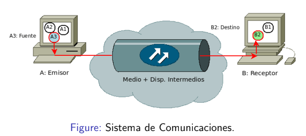
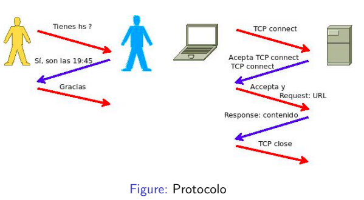

# Qué es una red?
## Qué es una red de computadoras?
Para no generalizar se pregunta sobre lo que vamos a estudiar.
### Análisis del punto de vista sistémico
- *Red de computadoras:* es un grupo de computadoras / dispositivos  interconectados
- *Objetivo:* compartir recursos (dispositivos, información, servicios).
- El conjunto de *computadoras*, *software de red*, *medios* y *dispositivos de interconexión* forma un sistema de comunicación.
- Ejemplos: red de sala de PCs, red Universitaria, Internet.

### Componentes de un sistema de comunicación
- Fuente (Software).
- Emisor/Transmisor (Hardware).
- Medio de transmisión y dispositivos intermedios (Hardware).
- Procesos intermedios que tratan la información (Software y Hardware).
- Receptor (Hardware).
- Destino (Software).
- Otros: Protocolos (Software), Información, mensaje transmitido (Software).
- Señal de Información, materialización del mensaje sobre el medio (Hardware?).

### Fuera del punto de vista sistémico
#### Componentes
- Computadoras, en el modelo de Internet: Hosts (PCs, laptops, servidores).
- Routers/switches, Gateways, AP (Access Points).
- NIC (placas de red), Modems.
- Vínculos/ enlaces: conformados por:
    - Medios: cables, fibras  ́opticas, se ̃nales electromagn ́eticas, antenas, interfaces, etc.
- Programas: Browsers, Servidores Web, Clientes de Mail,
- Servidores de Streaming.
- Etc...

Las componentes de la red deben interactuar y combinarse a través de reglas.

## Protocolo
Es el conjunto de conductas y normas a conocer, respetar y cumplir no sólo en el medio oficial ya establecido, sino también en el medio social, laboral, etc.

Un protocolo define el formato, el orden de los mensajes intercambiados y las acciones que se llevan a cabo en la transmisión y/o recepción de un mensaje u otro evento.

### Protocolo de red:
Conjunto de reglas que especifican el intercambio de datos u órdenes durante la comunicación entre las entidades que forman parte de una red. Permiten la comunicación y están implementados en las componentes.

## Stack TPC / IP  (Transmission Control Protocol / Internet Protocol)
Es un conjunto de protocolos a estudiar a lo largo de la materia porque es el que más se difundió en el mundo.
### Se compone de 4 capas:
1. Capa de Aplicación
2. Capa de Transporte
3. Capa de Internet
4. Capa de Acceso a la Red (NAL)

La capa de abajo le da un servicio a la capa de arriba.

### Cada capa tiene su unidad de datos (PDU):

Se pueden utilizar ambos protocolos IPv4 e IPv6 a la vez.

## Consultas
- Se va a evaluar el saber los identificadores de las RFCs?
- Podría alguien no tener que depender de un proveedor de Internet y aún así acceder a toda la red?